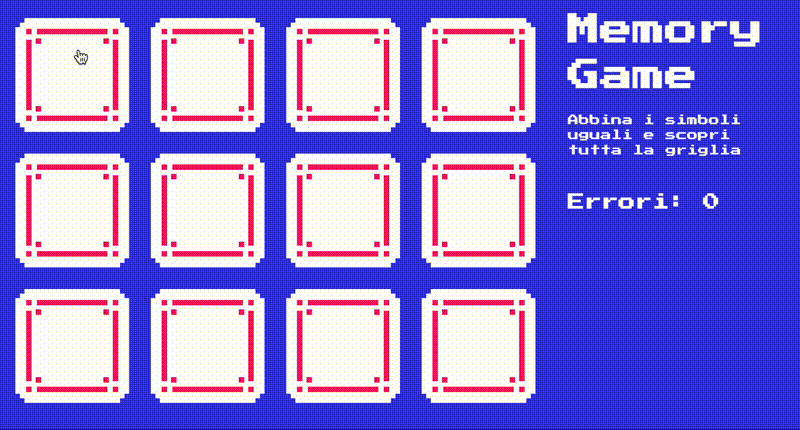

# Arcade: Memory Game

## Obiettivi

- Sviluppare logica di gioco con JS
- Implementare interazioni per la UI del gioco

## Argomenti da ripassare

- Fundamentals HTML, CSS e JS

# Consegna

Il gioco Memory è un classico passatempo che mette alla prova la memoria visiva dei giocatori. L'obiettivo è trovare tutte le coppie di carte identiche facendo meno errori o nel minor tempo possibile.

Sviluppiamo interfaccia e logica di gioco usando solo HTML, CSS e JS.

**Regole del gioco:**

- le card di gioco sono mescolate in maniera casuale a ogni caricamento di pagina (ogni gioco in pratica è sempre diverso)
- a inizio gioco tutte le carte sono coperte
- clicca su una carta per scoprirla
- ogni volta che una coppia di carte viene scoperta, controlla se sono uguali:
    - se lo sono, le carte restano scoperte
    - se non lo so, le carte tornano a nascondersi
- c’è un counter per contare gli errori commessi
- il gioco finisce quando tutte le carte sono state scoperte

Rimetti “in gioco” tutto quello che sai sulle basi di HTML, CSS e JS.

# Suggerimenti

- Ci sono varie tecniche per implementare la logica di gioco; scegli quella che ritieni opportuna purché sia in grado di spiegarla
- Ragiona per stati e dati di gioco (ad es. le card potrebbero essere rappresentate da un array…)
- Non è necessario che il gioco sia responsive, limitiamoci alla versione desktop
